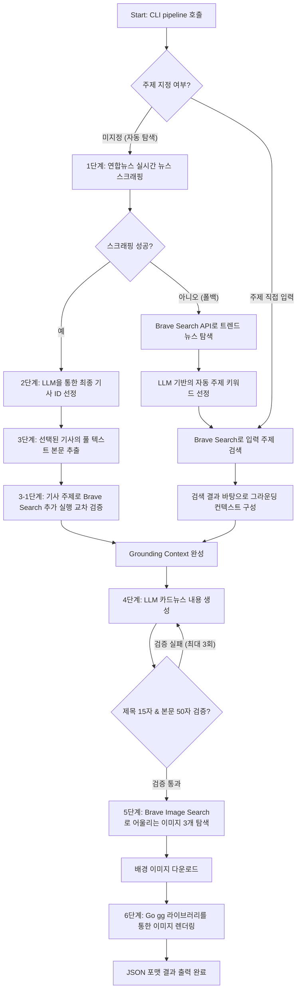

# 자동화 카드뉴스 생성 CLI (Serendipity CLI)

Brave Search API, OpenRouter LLM, Go 이미지 라이브러리(`fogleman/gg`) 및 연합뉴스 실시간 스크래퍼를 연동하여 뉴스 수집부터 카드뉴스 기획, 이미지 렌더링까지 전 과정을 자동화한 강력한 CLI(Command Line Interface) 도구입니다.

이 도구는 독립적인 실행파일로 동작하며, 디스코드 봇이나 웹 서버 등 다른 서비스에서 서브프로세스로 호출하여 뉴스 콘텐츠 및 카드뉴스를 빌드하는 핵심 그래픽/LLM 엔진 역할을 수행합니다.

---

## 1. 주요 특징

1. **자동 생성 파이프라인 (pipeline 모드)**
   - 연합뉴스 메인 페이지를 실시간 스크래핑하고 LLM이 오늘의 핫이슈 국내 뉴스를 자동 선정합니다.
   - 선정된 뉴스 상세 본문을 크롤링하고 Brave Search로 추가적인 교차 검증 정보까지 끌어모아 정확한 사실 기반의 콘텐츠를 기획합니다.
2. **제한형 카드뉴스 렌더러 (render 모드)**
   - 이미 기획된 카드뉴스 텍스트(JSON)와 직접 수급한 배경 이미지를 결합하여 Go `gg` 라이브러리로 네이티브 2D 그래픽 렌더링만을 단독 실행할 수 있습니다.
3. **엄격한 글자 수 가드레일 (Validator Guardrail)**
   - 카드 템플릿 레이아웃의 완성도를 보장하기 위해 **제목 15자 이내, 본문 50자 이내** 제한을 둡니다.
   - LLM 프롬프트 제어뿐만 아니라 프로그램 레벨(Go `rune` 단위 글자 수 측정)에서 실시간으로 검증하여, 불일치 시 자동으로 재생성 루틴을 수행합니다.
4. **안정적인 에러 헨들링 및 자율적 폴백(Fallback)**
   - 연합뉴스 사이트 장애나 파싱 실패 시, 즉시 Brave Search API 기반의 자율 주제 탐색 모드로 매끄럽게 전환(Fallback)됩니다.
   - API 레이트 리밋에 대응하기 위해 최대 3회의 지수 백오프(Exponential Backoff) 재시도 메커니즘을 내장하고 있습니다.
5. **네이티브 이미지 렌더링**
   - 획득한 배경 이미지들에 어두운 오버레이 레이어를 합성하고, `Noto Sans CKR` 한글 서체 자간/행간 조율 및 텍스트 자동 줄바꿈 알고리즘을 적용하여 고품질 카드뉴스를 렌더링합니다.

---

## 2. 전체 파이프라인 아키텍처 (Pipeline Architecture)

전체 뉴스 생성 및 이미지 빌드 파이프라인은 [pipeline.go](file:///home/user/serendipity/internal/pipeline/pipeline.go)의 `Run()` 함수를 중심으로 설계되었으며, 총 6단계의 세부 프로세스로 실행됩니다.



---

## 3. CLI 사용 가이드 및 옵션 (Parameters)

바이너리를 실행할 때 제공되는 옵션 플래그(파라미터) 목록입니다.

### 3.1 파라미터 상세 설명

| 플래그명 | 타입 | 기본값 | 필수 여부 | 상세 설명 및 제약 조건 |
| :--- | :--- | :--- | :--- | :--- |
| **`-mode`** | `string` | `"pipeline"` | 선택 (Optional) | 실행 모드를 설정합니다.<br>• `pipeline`: 뉴스 탐색/기획부터 렌더링까지 전체 자동화 실행<br>• `render`: 기획된 카드 텍스트와 배경 이미지로 2D 그래픽 렌더링만 실행 |
| **`-topic`** | `string` | `""` | 선택 (Optional) | 카드뉴스의 기사 주제어(키워드)입니다.<br>• 미지정 시: 실시간 연합뉴스를 크롤링하여 LLM이 자동 선정합니다.<br>• 지정 시: 입력한 검색어로 뉴스 정보를 수집해 카드뉴스를 기획합니다. |
| **`-output`** | `string` | `"./output"` | 선택 (Optional) | 렌더링 결과 이미지 파일(.png)들이 생성될 대상 폴더 경로입니다. |
| **`-config`** | `string` | `"config.yml"` | 선택 (Optional) | API Key 및 LLM 모델 옵션 등이 기록된 설정 파일의 로컬 경로입니다. |
| **`-auto`** | `boolean` | `false` | 선택 (Optional) | 연합뉴스 실시간 뉴스 탐색을 강제 활성화할 것인지 여부입니다. (주제가 비어 있으면 자동으로 활성화됩니다.) |
| **`-cards`** | `string` | `""` | **`render` 모드 시 필수** | 렌더링할 슬라이드 카드뉴스 데이터입니다. 엄격한 JSON 배열 포맷 문자열이어야 합니다.<br>• 구조: `[{"title":"제목","body":"본문"}]`<br>• 제약: 제목 15자 이내, 본문 50자 이내 준수 권장 |
| **`-bg`** | `string` | `""` | 선택 (Optional) | `render` 모드에서 합성할 로컬 배경 이미지 파일의 절대/상대 경로입니다. 지정하지 않을 시 어두운 단색 기본 디자인이 합성됩니다. |

### 3.2 실행 예시 (Commands)

#### 1) 전체 자동 카드뉴스 생성 (실시간 연합뉴스 크롤링 기반)
주제나 키워드를 입력하지 않고 실시간 트렌드 기사 10개를 긁어와 그 중 1순위를 선정한 후 자동 제작합니다.
```bash
./serendipity -mode pipeline -config config.yml -output ./output/news_auto
```

#### 2) 특정 주제 지정 수동 생성
지정된 주제(`-topic`)로 인터넷 정보들을 보완 탐색하여 카드뉴스를 기획 및 제작합니다.
```bash
./serendipity -mode pipeline -topic "인공지능 트렌드" -output ./output/ai_trends
```

#### 3) 수동 카드 정보 및 이미지로 카드 렌더링 (render 모드)
이미 기획된 JSON 데이터와 로컬 이미지 파일 경로를 주입해 카드뉴스 그래픽 드로잉만 직접 실행합니다.
```bash
./serendipity -mode render \
  -cards '[{"title":"AI 혁명","body":"생성형 AI가 일상과 비즈니스를 어떻게 바꿨는지 알아봅니다."},{"title":"미래의 일자리","body":"인간과 AI가 협업하는 새로운 시대의 직무 변화에 대해 알아봅니다."}]' \
  -bg "./my_background.jpg" \
  -output "./output/rendered_custom"
```

---

## 4. 출력 구조 (Stdout JSON Output)

성공적으로 전체 파이프라인 혹은 렌더러가 완료되면, CLI는 **표준 출력(Stdout)**으로 다음과 같은 JSON 데이터 구조를 인쇄합니다. 호출하는 서비스는 이 출력을 파싱하여 데이터를 활용할 수 있습니다.

```json
{
  "Topic": "생성형 AI 시대의 생존 전략",
  "Cards": [
    {
      "title": "생성형 AI 시대",
      "body": "우리의 일상과 산업 생태계가 인공지능 기술로 인해 급변하고 있습니다."
    }
  ],
  "OutputDirs": [
    "./output/news_01/variation_1",
    "./output/news_01/variation_2"
  ],
  "BgImageURLs": [
    "https://example.com/image1.jpg",
    "https://example.com/image2.jpg"
  ]
}
```
*실행 과정에서 나타나는 실시간 진행 로그는 **표준 에러(Stderr)**로 스트리밍되므로, 호출 서비스에서 진행률 로그를 분리해서 파싱할 수 있습니다.*

---

## 5. 프로젝트 폴더 구조

```
serendipity/
├── cmd/
│   └── cli/
│       └── main.go          # CLI 진입점 (플래그 파싱 및 동작 제어)
├── internal/
│   ├── config/              # config.yml 파싱 및 저장 로직
│   ├── llm/                 # OpenRouter API 연동, 주제/기사선정 및 카드뉴스 생성 인터페이스
│   ├── pipeline/            # 전체 자동화 파이프라인 통제 허브 (Run API)
│   ├── renderer/            # Go gg 라이브러리 기반 2D 이미지 레이아웃 드로잉 엔진
│   └── search/              # 외부 데이터 탐색 모듈 (Brave Search API & 연합뉴스 스크래퍼)
├── prompts/                 # LLM에 사용되는 역할 정의 및 제약조건 프롬프트 파일들
├── config.yml               # 시스템 API Key 및 프레임워크 설정 파일 (자동 생성)
└── go.mod
```
