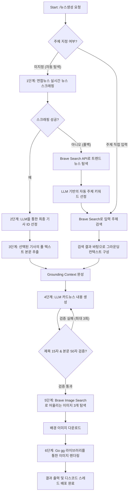

# 자동화 카드뉴스 생성기 (디스코드 봇 지원)

Brave Search API, OpenRouter LLM, Go 이미지 라이브러리(`fogleman/gg`) 및 연합뉴스 실시간 스크래퍼를 연동하여 뉴스 수집부터 카드뉴스 기획, 이미지 렌더링, 그리고 디스코드 봇 배포까지 모든 과정을 자동화한 엔터프라이즈급 프로젝트입니다.

---

## 1. 주요 특징

1. **디스코드 봇 스레드(Thread) 격리 아키텍처**
   - 채널의 난잡함을 막기 위해 최초 뉴스 생성 요청 시 **전용 스레드를 자동으로 개설**합니다.
   - 파이프라인의 모든 세부 빌드 로그(서칭, LLM 요청, 본문 추출, 렌더링 상태 등) 및 결과물, 상호작용 버튼(재생성, 변형 선택)이 스레드 내부에서만 구동됩니다.
2. **연합뉴스 실시간 스크래핑 & LLM 기사 선정**
   - Brave Search API의 할당량을 절약하고 국내 최신 실시간 속보를 정확하게 반영하기 위해 연합뉴스(`yna.co.kr`)의 실시간 기사를 분석하여 후보군을 확보한 후, LLM이 카드뉴스에 가장 적합한 기사를 지능적으로 선택합니다.
3. **엄격한 글자 수 가드레일 (Validator Guardrail)**
   - 카드뉴스 템플릿의 UI 완성도를 극대화하기 위해 **제목 15자 이내, 본문 50자 이내** 제한을 둡니다.
   - LLM 프롬프트 제어뿐만 아니라 프로그램 레벨(Go `rune` 단위 글자 수 측정)에서 실시간으로 검증하여, 불일치 시 자동으로 재생성 루틴을 수행합니다.
4. **안정적인 에러 헨들링 및 자율적 폴백(Fallback)**
   - 연합뉴스 사이트 장애 시 즉시 Brave Search API 기반의 자율 주제 탐색 모드로 매끄럽게 전환(Fallback)됩니다.
   - API 통신 장애나 레이트 리밋에 대응하기 위해 최대 3회의 **지수 백오프(Exponential Backoff)** 재시도 메커니즘을 내장하고 있습니다.
5. **3가지 배경 이미지 변형(Variation) 및 렌더링**
   - 기사 맥락에 어울리는 최적의 배경 이미지 3개를 Brave Image Search를 통해 실시간 탐색합니다.
   - Go 이미지 라이브러리([renderer.go](file:///home/user/serendipity/internal/renderer/renderer.go))를 사용하여 다운로드한 배경 이미지마다 각각의 카드뉴스 세트(총 9장의 이미지)를 디자인 요소(자간, 그림자, 어두운 그라데이션 오버레이, 폰트 비율)에 맞춰 네이티브로 정밀 렌더링합니다.

---

## 2. 전체 파이프라인 아키텍처 (Pipeline Architecture)

전체 뉴스 생성 및 이미지 빌드 파이프라인은 [pipeline.go](file:///home/user/serendipity/internal/pipeline/pipeline.go)의 `Run()` 함수를 중심으로 설계되었으며, 총 6단계의 세부 프로세스로 실행됩니다.



### 2.1 단계별 세부 동작 메커니즘

#### 1단계: 실시간 뉴스 스크래핑 (Scrape & Metadata Analysis)
- **주요 관련 코드**: [yonhap.go](file:///home/user/serendipity/internal/search/yonhap.go) -> `FetchYonhapTopNews()`
- **동작**:
  1. `https://www.yna.co.kr` 메인 페이지의 HTML 전체를 GET 요청으로 수집합니다. 봇 차단을 우회하기 위해 브라우저의 User-Agent 헤더를 주입합니다.
  2. 국내 주요 뉴스 카테고리(`politics`, `economy`, `society`, `industry`, `culture`, `entertainment`, `sports`, `local`)의 링크 정규식 패턴(`view/(AKR[0-9A-Z]+)\?section=...`)을 매칭하여 고유 기사 ID(`AKR...`)를 중복 없이 최대 30개 파싱합니다.
  3. 추출된 ID를 기반으로 상세 페이지(`https://www.yna.co.kr/view/{ID}`)에 헤드 요청에 가까운 최적화 기법(HTML의 앞쪽 16KB 데이터만 읽기)을 적용하여 로드합니다.
  4. HTML 내부의 Open Graph 메타데이터인 `<meta property="og:title" content="...">`, `og:description`, `article:section`을 정규식으로 파싱하여 기사 제목, 요약문, 섹션을 추출합니다.
  5. 국제 정세 뉴스 등 국내 이슈와 동떨어진 대상을 걸러내기 위해 `국제` 섹션 뉴스는 필터링하고 최신 10개의 고유 기사 메타데이터 후보군을 생성합니다.

#### 2단계: LLM 기반 최종 기사 ID 선정 (LLM Article Selection)
- **주요 관련 코드**: [llm.go](file:///home/user/serendipity/internal/llm/llm.go) -> `SelectArticleID()`, [select_article_system.txt](file:///home/user/serendipity/prompts/select_article_system.txt)
- **동작**:
  1. 1단계에서 구성된 10개의 최신 기사 목록(ID, 제목, 요약, 카테고리)을 정제된 텍스트 형식으로 LLM에 전달합니다.
  2. 시스템 프롬프트를 통해 "카드뉴스로 변환했을 때 대중적 관심도가 높고 파급력이 크며 시각화하기 좋은 최선의 기사"를 1개 엄선하도록 지시합니다.
  3. LLM은 설명이나 수식어 없이 오직 **선택한 기사의 고유 ID (예: AKR2026...) 한 줄만 반환**하도록 제한됩니다.
  4. 만약 LLM이 존재하지 않는 ID를 임의로 출력(환각)할 경우를 대비하여 코드단에서 ID 검증 과정을 거치며, 검증 실패 시 기사 목록의 첫 번째 기사를 안전 장치로 자동 지정합니다.

#### 3단계: 기사 본문 상세 추출 (Full Text Extraction)
- **주요 관련 코드**: [yonhap.go](file:///home/user/serendipity/internal/search/yonhap.go) -> `FetchYonhapArticleBody()`
- **동작**:
  1. 선정된 기사의 원문 상세 URL(`https://www.yna.co.kr/view/AKR...`)로 전체 본문 HTML을 요청합니다.
  2. 연합뉴스의 기사 본문 영역을 지정하는 특정 HTML 태그인 `<article id="articleWrap">` 혹은 `<article id="dic_area">`를 정규식으로 검출하여 그 내부의 HTML 마크업만 파싱합니다.
  3. `<[^>]*>` 태그 매칭 정규식을 실행하여 HTML 태그를 모두 걷어내고, `&nbsp;`, `&quot;`, `&apos;` 등 HTML 특수 기호를 사람이 읽을 수 있는 텍스트로 치환합니다.
  4. 여러 개의 공백문자 및 줄바꿈을 일련의 공백 하나(` `)로 축소함으로써 LLM이 기사 팩트를 한눈에 읽을 수 있는 최적의 **그라운딩 컨텍스트(Grounding Context)**로 변형합니다.

#### 4단계: 카드뉴스 내용 생성 및 유효성 검사 (Cardnews Generation & Guardrail)
- **주요 관련 코드**: [llm.go](file:///home/user/serendipity/internal/llm/llm.go) -> `GenerateCardNews()`, [generate_card_news_system.txt](file:///home/user/serendipity/prompts/generate_card_news_system.txt)
- **동작**:
  1. 기사의 제목, 요약, 정제된 본문 텍스트를 바탕으로 3개의 슬라이드(제목, 본문) 카드뉴스를 JSON 스키마 형태로 생성할 것을 LLM에 요청합니다.
  2. **가장 중요한 UI 제약 조건**: 카드뉴스의 조형적 밸런스를 해치지 않기 위해 **슬라이드별 제목은 공백 포함 15자 이내, 본문은 50자 이내**로 고정합니다.
  3. LLM의 응답을 수신한 후, JSON에서 유효한 배열 데이터만 뽑아내기 위해 대괄호(`[` 및 `]`)의 가장 바깥 경계를 분석하여 JSON 포맷을 정제합니다 (`SanitizeJSON`).
  4. **Validator Guardrail**: 파싱된 각 슬라이드 객체를 반복문으로 순회하며 Go의 유니코드 문자열 길이(`len([]rune(card.Title))`, `len([]rune(card.Body))`)를 직접 계산합니다. 15자 혹은 50자를 한 글자라도 초과하는 경우 즉시 에러 처리를 하고 재수행 프로세스를 트리거합니다.
  5. 에러가 발생하면 지수 백오프(1초, 2초, 4초 대기)를 거쳐 최대 3회까지 LLM에 재생성 요청을 보냅니다.

#### 5단계: 배경 이미지 탐색 및 다운로드 (Image Crawling)
- **주요 관련 코드**: [search.go](file:///home/user/serendipity/internal/search/search.go) -> `SearchImages()`, [pipeline.go](file:///home/user/serendipity/internal/pipeline/pipeline.go) -> `downloadImage()`
- **동작**:
  1. 기획된 카드뉴스의 1번째 카드(표지) 제목 혹은 핵심 주제 키워드를 검색 쿼리로 지정합니다.
  2. Brave Search Image API를 구동하여 쿼리에 매칭되는 이미지 3장의 고화질 원본 웹 URL을 수집합니다.
  3. 로컬 출력 디렉토리를 마련하고 각각의 이미지 URL로 GET 요청을 보낸 뒤 바이너리 복사(`io.Copy`)를 통해 `bg_1.jpg`, `bg_2.jpg`, `bg_3.jpg` 파일로 저장합니다. 
  4. 이미지 다운로드 중 깨진 포맷(unknown format)이나 네트워크 실패가 발생하면, 파이프라인 전체가 멈추지 않고 해당 이미지 변형에 한해서만 빈 값(기본 어두운 단색 템플릿 사용)으로 안전하게 대처합니다.

#### 6단계: 네이티브 카드뉴스 이미지 렌더링 (Native Graphic Rendering)
- **주요 관련 코드**: [renderer.go](file:///home/user/serendipity/internal/renderer/renderer.go) -> `RenderCards()`
- **동작**:
  1. Go 언어의 2D 벡터 그래픽 엔진인 `gg` 패키지를 통해 표지 및 내용을 그립니다.
  2. 다운로드된 3장의 원본 배경 이미지를 각각 배경으로 채택하여, 총 3개 카드뉴스 세트(세트당 3장씩 총 9장)를 개별 독립 폴더(`variation_1`, `variation_2`, `variation_3`)에 병렬적으로 구성해 냅니다.
  3. 각 이미지에는 원본의 화려함으로 인해 텍스트 가독성이 저하되는 것을 완전히 막기 위해 **어두운 반투명 검은색 그라데이션 및 오버레이 레이어**를 합성합니다.
  4. 폰트는 가독성이 검증된 `Noto Sans CKR` 서체를 사용하며, 제목과 본문 텍스트의 장평/자간/행간을 세밀하게 조율하고, 경계를 벗어나는 긴 문장을 자동으로 줄바꿈(Wrap) 처리하는 레이아웃 알고리즘을 수행하여 정밀 렌더링합니다.

---

## 3. 프로젝트 폴더 구조

```
serendipity/
├── cmd/
│   └── bot/
│       └── main.go          # 디스코드 봇 구동 진입점 (Slash Command 등록 및 세션 제어)
├── internal/
│   ├── bot/                 # 디스코드 이벤트 핸들러 & 스케줄러 핵심 로직
│   │   ├── bot.go               # 디스코드 연결 세션 초기화 및 스케줄러 관리
│   │   ├── handler_news.go      # /뉴스생성 커맨드 처리, 스레드 생성 및 로깅 
│   │   ├── handler_component.go # 버튼 상호작용 (변형 선택, 제목/이미지 재생성)
│   │   └── handler_setting.go   # /세팅 커맨드 처리 (동적 API Key 관리)
│   ├── config/              # config.yml 파싱 및 저장 로직
│   ├── llm/                 # OpenRouter API 연동, 주제/기사선정 및 카드뉴스 생성 인터페이스
│   ├── pipeline/            # 전체 자동화 파이프라인 통제 허브 (Run API)
│   ├── renderer/            # Go gg 라이브러리 기반 2D 이미지 레이아웃 드로잉 엔진
│   └── search/              # 외부 데이터 탐색 모듈 (Brave Search API & 연합뉴스 스크래퍼)
├── prompts/                 # LLM에 사용되는 역할 정의 및 제약조건 프롬프트 파일들
├── config.yml               # 시스템 API Key 및 프레임워크 설정 파일 (최초 실행 시 자동 생성)
└── go.mod
```

---

## 4. 사전 요구사항 및 설정

### 4.1 시스템 설치 도구
- **Go 1.25 이상** 설치 권장.
- 한글 카드뉴스의 텍스트가 정상적으로 그려질 수 있도록 `assets` 혹은 시스템 내에 맑은 고딕 또는 `Noto Sans CKR`과 같은 한글 지원 TTF 폰트 파일이 구비되어 있어야 합니다.

### 4.2 설정 구성 (`config.yml`)
프로젝트 최초 실행 시 실행 위치에 다음 템플릿의 `config.yml` 파일이 자동 빌드됩니다. 필수 키값을 채워주십시오.

```yaml
brave_api_key: "YOUR_BRAVE_SEARCH_API_KEY"
openrouter_api_key: "YOUR_OPENROUTER_API_KEY"
llm_model: "google/gemini-2.5-flash"
discord_bot_token: "YOUR_DISCORD_BOT_TOKEN"
```
*디스코드 채널 안에서 `/세팅` 슬래시 커맨드를 입력하여 디스코드 화면상에서 즉시 API Key 등을 실시간으로 업데이트할 수 있습니다.*

---

## 5. 빌드 및 구동 방법

```bash
# 1. 원본 저장소 복사
git clone https://github.com/sleepysoong/serendipity.git
cd serendipity

# 2. Go 모듈 다운로드 및 의존성 주입
go mod tidy

# 3. 바이너리 컴파일
go build -o bot ./cmd/bot/

# 4. 봇 구동
./bot
```

---

## 6. 디스코드 명령어 가이드

봇 구동 후, 디스코드 서버 내에서 다음 슬래시 커맨드들을 사용하실 수 있습니다.

- **/뉴스생성 `[주제/키워드]`**
  - 특정 주제어를 주입하면 해당 주제에 맞게 카드뉴스를 구성합니다.
  - 주제어를 주입하지 않고 빈 채로 전송하면, 파이프라인 내부 알고리즘에 따라 자동으로 연합뉴스의 실시간 최신 국내 기사 10개를 조사하고 LLM이 오늘의 대표 헤드라인 기사를 엄선하여 발행합니다.
  - 실행 즉시 채널 내부에 **"카드뉴스 생성 로그 - {주제}" 스레드가 개설**되며 상세 진행 내역이 전달됩니다.
- **/뉴스채널**
  - 매일 오전 00:00시에 자동으로 작동하는 스케줄러 뉴스를 전송받을 공식 텍스트 채널을 현재 명령어가 입력된 채널로 변경 및 고정합니다.
- **/세팅**
  - Brave Search API Key, OpenRouter Token, 사용 LLM 모델명, Discord Bot Token 값을 디스코드 모달창 인터페이스를 통해 직접 기입하고 실시간 적용합니다.

---

## 7. 시스템 장애 제어 및 안정성 보장 기술

1. **Brave Search Fallback**: 연합뉴스 웹 페이지 구조 변경이나 크롤러 차단으로 인해 속보 수집이 실패한 경우, 즉시 Brave Search API를 이용한 기존의 인터넷 핫토픽 실시간 검색 방식으로 모드를 전환해 뉴스 파이프라인의 영속성을 보장합니다.
2. **지수 백오프 (Exponential Backoff)**: LLM과의 통신 단절, API 레이트 리밋 제한이 검출될 경우 즉각 1초, 2초, 4초 간격으로 점증 대기한 뒤 재시도를 요청하여 불필요한 크래시 발생을 억제합니다.
3. **프로그램 문자열 바운더리 검증 (Rune-level Verification)**: LLM이 영문이나 멀티바이트 문자(한글) 개수 계산 실수로 카드 텍스트 길이를 초과하는 카드 데이터를 전송할 경우, 이미지 드로잉 단계로 진입하기 전 Go 언어 수준에서 걸러내어 즉각 재생성을 유도합니다.
4. **이미지 다운로드 에러 독립 격리**: 3가지 배경 변형 중 특정 이미지 서버의 응답 지연이나 파일 결함 등으로 로드에 실패하더라도, 해당 변형 세트만을 기본 디자인 템플릿(어두운 그라데이션 솔리드 컬러)으로 대체해 이미지 렌더링을 끝까지 성공시킵니다.
